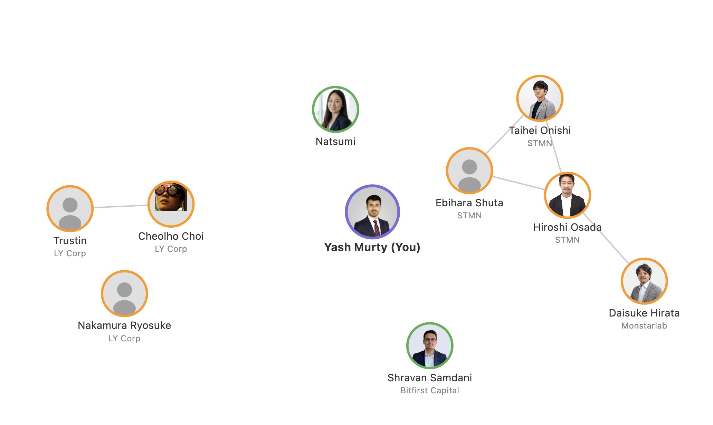

# Obsidian People Graph

A visual force-directed graph of people and friends in your vault. See your personal network as an interactive map with photo nodes, closeness-based positioning, and company clustering.



## Features

- **Force-directed graph** — people are rendered as circular nodes connected by relationship edges
- **Closeness positioning** — nodes with higher closeness scores orbit closer to the center "You" node
- **Company clustering** — people from the same company are grouped together
- **Photo nodes** — circular photos from your vault, with a default avatar silhouette fallback
- **Closeness ring colors** — green (8-10), orange (4-7), gray (1-3)
- **Click to open** — click any person node to open their note
- **Hover tooltips** — see name, company, role, and closeness at a glance
- **Zoom and pan** — scroll to zoom, drag to pan, double-click to reset
- **Live updates** — graph refreshes automatically when you edit a note
- **Configurable** — choose which frontmatter field identifies person notes, exclude folders, toggle edges, clustering, and more

## Setup

### 1. Install the plugin

Search for **"People Graph"** in Settings > Community Plugins > Browse, then click Install and Enable.

### 2. Create person notes

Add frontmatter to your notes to identify them as people:

```yaml
---
type: person
name: Jane Doe
photo: attachments/jane.jpg
company: Acme Corp
role: Engineer
closeness: 8
knows:
  - "[[John Smith]]"
  - "[[Mike Lee]]"
tags:
  - people
---
```

### Field reference

| Field | Type | Required | Description |
|---|---|---|---|
| `type` | string | No | Default field used to identify person notes (configurable in settings) |
| `name` | string | No | Display name on graph node (falls back to filename) |
| `photo` | string | No | Vault-relative path to photo file |
| `company` | string | No | Used for clustering nodes |
| `role` | string | No | Shown on hover tooltip |
| `closeness` | number 1-10 | No | Distance from center (default: 5). 10 = closest, 1 = furthest |
| `knows` | wikilink(s) | No | Edges drawn between these people. Supports array or single value |
| `tags` | string array | No | For filtering in future versions |
| `is_self` | boolean | No | Mark this note as "you" — becomes the center node of the graph |

The detection field and value are configurable in settings. For example, you can use `tags: [people]` instead of `type: person`.

To mark one of your person notes as "you" (the center of the graph), add `is_self: true` to its frontmatter:

```yaml
---
type: person
name: Your Name
is_self: true
photo: attachments/me.jpg
---
```

### 3. Open the graph

- Click the **people icon** in the left ribbon, or
- Open the command palette (Cmd/Ctrl+P) and search for **"Open People Graph"**

## Settings

| Setting | Description | Default |
|---|---|---|
| Frontmatter field | Which field identifies person notes | `type` |
| Field value | What value to match | `person` |
| Exclude paths | Comma-separated folders/files to skip | `Templates` |
| Enable clustering | Group nodes by company | On |
| Cluster strength | How strongly same-company nodes attract | 0.3 |
| Show edges | Draw lines between people who know each other | On |
| Edge opacity | Opacity of relationship lines | 0.4 |
| Show closeness ring | Color node ring by closeness score | On |

## Privacy

To build the graph, this plugin scans your vault's markdown files for notes that match your configured person frontmatter (it reads file paths and frontmatter only). It runs entirely locally and makes **no network requests** — your data never leaves your vault.

## Roadmap

Ideas planned for future releases:

- Export graph as SVG (PNG export is already av1ailable from the view toolbar)
- Filter view by tag or company
- Color themes

## Development

```bash
# Install dependencies
npm install

# Build for production
npm run build

# Development mode (watch)
npm run dev
```
